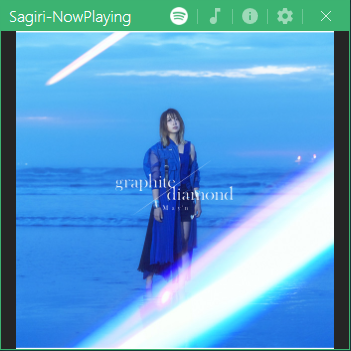
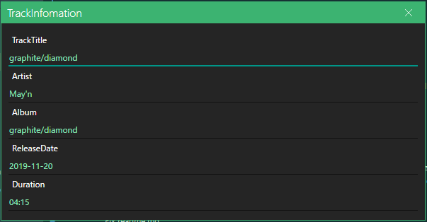

# Sagiri

Sagiri makes full use of Spotify-WebAPI It's third party app.
Getting general spotify current track information tracks.
Let's enjoy! 

### ○Features

* ✅ Supports posting current track information at Misskey.
* ✅ Supports .NET 7.
* ✅ Logging supported.
* ❌ Spotify Control Module UI fixed.
* ❌ Supports posting current track information at Twitter(API-Dead...).

### ○Capture Images

* MainWindow  


* InfoWindow  


### ○Docs and Usage

```csharp
// Before Settings.
// Sagiri > Util > Constants.cs
internal static readonly string ClientId = "your spotify-development application client id.";
internal static readonly string ClientSecret = "your spotify-development application client secret.";

// WinForms
using Sagiri.Services.Spotify;
using Sagiri.Services.Spotify.Track;

public async void Form1_Load(object sender, EventArgs e)
{
    _IMisskeyService = new MisskeyService();
    await _IMisskeyService.InitializeAsync();

    _ISpotifyService = new SpotifyService();
    _CurrentTrackInfo = new();
    _SpotifyCredentialConfig = SpotifyCredentialConfig.Instance;

    _Logger = Logger.GetInstance;

    await _ISpotifyService.InitializeAsync();
    if (_SpotifyCredentialConfig.IsExistCredentialFile())
    {
        _ISpotifyService.CurrentTrackChanged += _OnSpotifyCurrentlyPlayingChanged;
        _ISpotifyService.CurrentTrackErrorDetected += _OnSpotifyCurrentTrackErrorDetected;

        await _ISpotifyService.StartAsync(_CancellationSource.Token).ConfigureAwait(false);

        var accountImageStream = await _ISpotifyService.GetUserImageStream();
        AccountPanel.BackgroundImage = System.Drawing.Image.FromStream(accountImageStream) ?? Resources.account;
    }
    else
    {
        var message = "[SagiriUI] - Spotify tokens file not found...\r\nClose this app.";
        MessageBox.Show(message);
        _Logger.WriteLog(message, Logger.LogLevel.Fatal);

        this.Close();
    }

    _Logger.WriteLog("[SagiriUI] - Finished roading Form....", Logger.LogLevel.Info);
}
```
