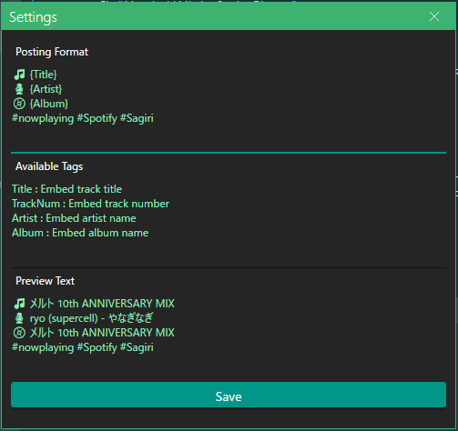

# Sagiri

Sagiri makes full use of Spotify-WebAPI It's third party app.
Getting general spotify current track information tracks.
Let's enjoy! 

### ○Features

* ✅ Supports posting current track information at Misskey.
* ✅ Supports .NET 7.
* ✅ Supports WPF(Prism + ReactiveProperty)
* ✅ Logging supported.
* ❌ Spotify Control Module UI fixed.
* ❌ Supports posting current track information at Twitter(API-Dead...).

### ○Capture Images

* MainWindow  

* InfoWindow  

* SettingWindow  

### ○Docs and Usage

